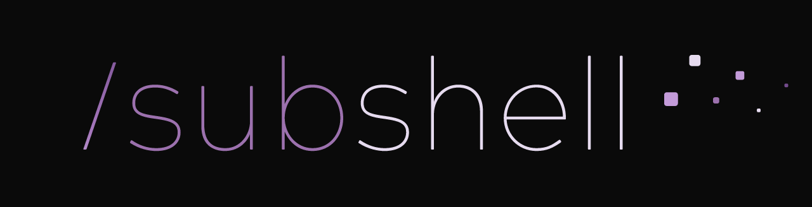
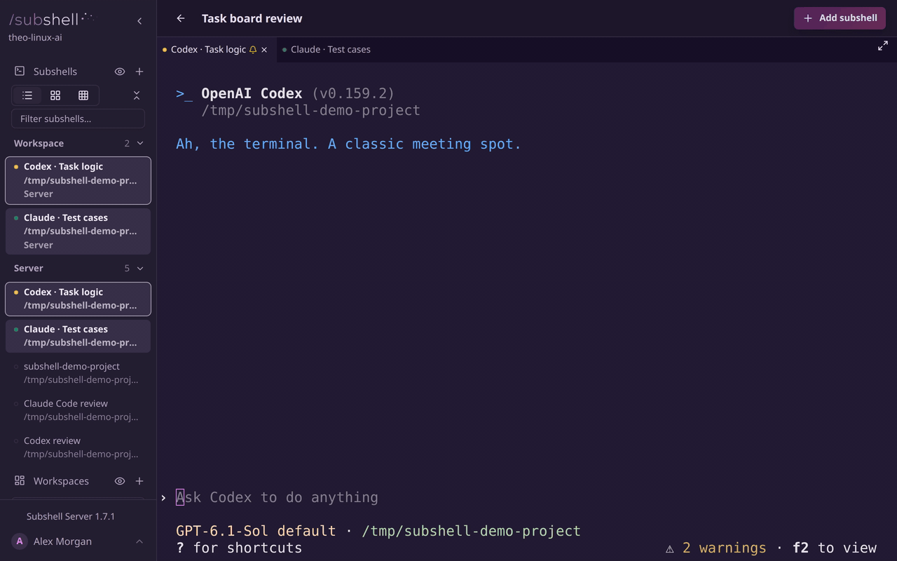

  

# Subshell

Subshell is an open-source, self-hosted dashboard for interactive coding agents.
Run Claude Code, Codex, and other agent CLIs on your own machines, then access
them from a browser or desktop app. Close the window and come back from another
device: your sessions keep running in tmux, with the same live terminal and
conversation waiting for you.

- **Your machines, your data.** Host the server yourself and run agents on its
  machine or enrolled nodes. Subshell requires no hosted Subshell service.
- **Your choice of agents.** Built-in plugins support Claude Code, Codex,
  OpenCode, Hermes, pi, and a plain terminal. Add more through the plugin API.
- **Work across devices.** Reconnect from a browser or desktop app, arrange
  sessions in workspaces, and share view or edit access with other users.
- **Let agents coordinate.** The built-in MCP server supports cross-agent
  communication, encrypted channels, and helper sessions.

## Get started

1. Visit [Subshell downloads](https://subshell.sh) and install **Subshell Server**
   on the machine that will host your instance.
2. Open the app and follow its setup experience to install the server and
   create your administrator account.
3. Launch an agent from the dashboard. To run agents on another machine,
   install **Subshell Client** there and [enroll it as a node](https://docs.subshell.sh/get-started/another-machine).

See [Install Subshell Server](https://docs.subshell.sh/install/desktop-server)
for desktop setup, or [Installation](https://docs.subshell.sh/install) for CLI,
Docker, and Proxmox LXC options. You can access the dashboard from a browser
or [Subshell Client](https://docs.subshell.sh/install/desktop-client).

## Documentation

The complete guides and references are at **[docs.subshell.sh](https://docs.subshell.sh)**.

- [What is Subshell?](https://docs.subshell.sh/about): capabilities and reasons to use it.
- [Get started](https://docs.subshell.sh/get-started): installation and access from other devices and machines.
- [Use Subshell](https://docs.subshell.sh/guides): sessions, workspaces, and sharing.
- [Server administration](https://docs.subshell.sh/administration): configuration, users, backups, and updates.
- [MCP and agent communication](https://docs.subshell.sh/mcp): tools, channels, and coordination.
- [Security model](https://docs.subshell.sh/concepts/security): protections, trust boundaries, and limitations.
- [Developer guides](https://docs.subshell.sh/developers): plugins, API integrations, and contributing.

## Contributing

Start with [Contribute to Subshell](https://docs.subshell.sh/developers/contribute)
for development setup and verification. Contributions require the one-time
[Contributor License Agreement](CLA.md).

For work in this repository, [AGENTS.md](AGENTS.md) contains development
instructions and routes to app-specific notes. The
[engineering documentation index](docs/README.md) covers security rationale,
release mechanics, the design system, and historical decisions.

## License

Subshell is free to self-host and uses two open-source licenses:

| Code | License |
| --- | --- |
| `apps/server/**`: the API, web dashboard, and server desktop app | [AGPL-3.0-only](apps/server/LICENSE) |
| Everything else: the node, client apps, plugins, and shared packages | [Apache-2.0](LICENSE) |

The server license includes an **API Type Surface exception**, allowing its
TypeScript API declarations to be used under Apache-2.0. The exception covers
types, not server implementation. See [the license text](apps/server/LICENSE)
for its scope and terms.

Subshell is copyright Disaresta, LLC. Commercial licenses for the control plane
are available to organizations that cannot use AGPL-licensed software;
contact [Theo Gravity](mailto:theo@disaresta.com).
