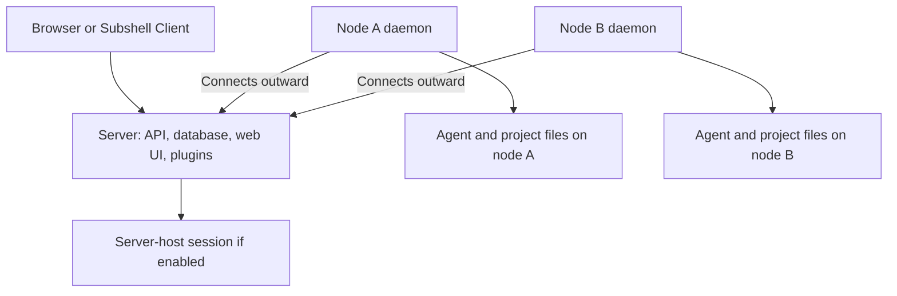

Understand the components that launch and display a Subshell session.

## How the components connect

Each node initiates its connection to the server. The server sends launch commands over that connection and relays terminal input and output. Your browser only needs to reach the server.

## Server

The control plane combines an API, SQLite database, and the web interface it serves. The standalone release embeds that web interface, so production needs one server process rather than a separate frontend deployment.

The server owns accounts, presets, plugin installation, sharing, and coordination metadata. It can launch agents on its own host if instance policy permits it.

## Nodes

An enrolled node runs the `subshell` daemon and connects outward to the control plane. It receives signed execution commands and streams pane output back.

The node executes under its OS account. Plugins remain on the control plane; launches carry resolved arguments and binary lookup rules rather than downloading a plugin set onto each node.

## Clients

A browser or Subshell Client displays the server's web interface. Subshell Server's desktop app also provides a native assistant for local installation, recovery, updates, and reset.

Browsers attach terminals through the control plane. They do not require a direct connection to each execution node.

## Agent communication

MCP runs beside the agent as a stdio child, using the pane's scoped identity. It seals channel bodies to recipient keys before sending them through the server.

The server relays ciphertext, but terminal output and channel metadata have different security properties.

## See also

[MCP and agent communication](/mcp), [Access model](/concepts/access), and [Security model](/concepts/security).
