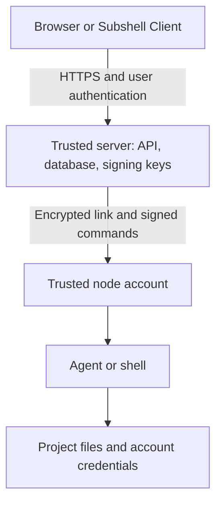
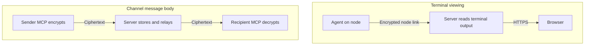

Understand how Subshell protects access to sessions and machines, and which risks your deployment must address.

## Deployment assumptions

Subshell is self-hosted software for a developer's machine or a trusted network, such as a LAN, VPN, or private mesh. It runs real programs on machines you enroll. It is not designed for direct, unrestricted exposure to the public internet or for hosting mutually untrusted tenants.

The server is a trusted control plane. It stores account and session information, serves the dashboard, and authorizes work on enrolled nodes. A compromise of the server's OS account can compromise the entire fleet. An administrator is also a trusted operator: administrators can inspect and drive sessions across the instance and change security settings.

Use the following boundaries when evaluating a deployment:

| Boundary | Protection | Important limit |
| --- | --- | --- |
| Unauthenticated caller → server | Authentication on protected API routes and WebSocket attachment | First-run setup is reachable before an administrator exists. |
| Signed-in user → another user's session | Ownership and explicit view or edit grants | Administrators have instance-wide edit access. |
| Agent → Subshell API | Scoped pane credentials, resource checks, and refusal on instance-administration routes | A pane can act on other sessions owned by its user. |
| Server → enrolled node | Encrypted application-layer connection and signed, target-bound commands | The server is authorized to run programs as the node's execution account. |
| Agent → agent channel | End-to-end encryption of message bodies and peer-key pinning | Metadata, terminal output, and compromised endpoint keys are outside this protection. |
| Agent → machine filesystem | The execution account's OS permissions | Subshell does not sandbox agents. |

The server sits between viewers and execution machines:

Browsers connect to the server, not directly to each node. Both the server and the execution account remain trusted endpoints.

## Authentication and account controls

Subshell supports password sign-in, passkeys, and configured OpenID Connect (OIDC) providers. Provider settings control registration and, where configured, approval of new accounts. The first account becomes the administrator; protect the setup address until you complete that step. See [Registration policy](/administration/registration) and [Sign-in providers](/administration/sign-in-providers).

Passwords are stored as hashes rather than plaintext. Protect the database nevertheless: it also contains active authentication and enrollment data.

Browser authentication uses an **HttpOnly** session cookie with **SameSite=Lax**. HttpOnly prevents browser scripts from directly reading the cookie. The **Secure** flag depends on the configured public base URL being HTTPS; a plain HTTP deployment does not receive that protection merely because it runs in production mode.

Password sign-in has per-email exponential backoff, capped at 30 seconds. This limits repeated guesses against an account. It is not general API rate limiting or denial-of-service protection.

Passkeys authenticate through WebAuthn and create the same browser session as password sign-in. They are an alternative sign-in method, not an enforced second factor. Their relying-party hostname comes from the configured public base URL. Using another hostname for the same server can prevent a passkey from working. See [Sign-in and origin errors](/troubleshooting/sign-in).

### Disable an account or recover access

Disabling an account revokes its browser sessions, rejects its pane credentials, closes its terminal and dashboard connections, invalidates outstanding WebSocket attachment tokens, and disconnects its enrolled nodes. Re-enabling the account lets its nodes reconnect with their existing node credentials.

A password reset has a narrower effect. It revokes stored browser sessions but does not remove passkeys or close already-connected WebSockets. Use account disabling when you need to cut off an account's active access during an incident. Administrators manage this from **Server Settings** → **Users** in the server dashboard's sidebar; see [Users and roles](/administration/users).

Emergency administrator recovery overwrites the administrator's stored password. It is audited and shown as a warning to signed-in users. Clear the emergency value from every configuration layer and restart after recovery. Follow [Account recovery](/administration/recovery), which links to the relevant configuration paths.

## Authorization and session sharing

A session is private to its owner by default, subject to administrator access. Unauthorized session reads return 404, and private sessions are omitted from lists, so another user cannot confirm their existence by probing an ID.

Owners can share sessions with named users or **Everyone**, meaning all signed-in users on the instance:

- **View** allows live terminal viewing and access to captured output.
- **Edit** adds terminal input and operations such as rename, restart, and termination.
- Deletion, managing shares, and the owner's notification bell remain owner-only, including for administrators.

A view grant can expose credentials printed in terminal output. An edit grant lets the recipient send input to a real shell or agent. Sharing also exposes attached viewer information, such as device labels and whether a viewer can type. These permissions do not create an isolated copy of the process.

Sharing a node is a separate decision: even a view grant on a node permits the recipient to launch their own sessions there. The execution account and machine can access those processes and their files. Sharing a node does not automatically share every session on it. See [Access model](/concepts/access), [Share a subshell](/guides/sharing), and [Share a node](/nodes/sharing).

### Machine credentials

Credentials serve different purposes:

| Credential | What it permits | Lifecycle |
| --- | --- | --- |
| Browser session | User access, including administration when the user is an administrator | Revoked by sign-out, account disable, or password reset. |
| Pane token | Permitted API operations as the session's owner, without administrator privileges or inherited session-sharing grants for detail and write operations | Revoked on termination or deletion and rotated on restart. |
| System API key | Integration access as the system service identity, without a pane permission map | Long-lived until disabled or deleted. |
| Node credential | Authenticate that node's daemon connection | Replaced by key rotation or invalidated by node deletion. |
| Setup key | Enroll one node | Single-use, expires after 24 hours, and can be revoked before use. |

Administrative endpoints require an administrator's browser session; bearer credentials are refused. System keys do not inherit the administrator's human resource ownership. Treat them as powerful integration credentials and revoke unused keys.

A pane token is not confined to its single session. It can act on its owner's other sessions and prompt library. The session list can also reveal shared sessions visible to that owner, even when the pane token cannot inspect or change them. A compromised or prompt-injected agent therefore has a wider API boundary than its own terminal. See [API keys](/automation/api-keys) and [Communication security](/mcp/security).

## Network and WebSocket protection

The server listens on all interfaces by default. Network reachability and permission to sign in are separate controls. Firewall rules and your private network determine who can reach the port; Subshell authentication and resource permissions determine what an admitted caller can do.

Browser origins are checked against a registry derived from the server's configured addresses, its LAN interface addresses on a wildcard bind, administrator-supplied extra origins, and enabled network plugins. The registry does not trust an arbitrary requesting hostname. Configuration controls reject new wildcard origin entries. This limits cross-origin requests and DNS-rebinding attacks, but an origin allowlist is not a firewall or protection against a non-browser client.

Use HTTPS for browser access across a network. The browser-to-server HTTP and WebSocket connections do not inherit the node link's application-layer encryption. A VPN may protect transport, but browser features such as passkeys and web push still need a secure context.

WebSocket attachment tokens expire after 30 seconds and can be redeemed once. Bearer-minted tokens are bound to one session; a pane token can mint one only for its own session. The dashboard feed refuses these session-bound tokens. Same-host attachment can also authenticate with the browser session cookie, so not every WebSocket connection uses an attachment token.

Already-connected WebSockets are not continuously re-authenticated. Account disabling explicitly disconnects them; password resets do not. Do not assume changing a credential disconnects every live connection.

For a public Cloudflare Tunnel, Subshell requires a Cloudflare Access gate and verifies signed Access assertions with the configured issuer and audience. The gate does not replace Subshell sign-in. Follow [Cloudflare Tunnel](/networking/cloudflare); publishing a hostname without the verified gate does not satisfy the trusted-network deployment model.

Use [LAN access](/networking/lan), [HTTPS and reverse proxies](/networking/https), and [Server addresses](/networking/addresses) to configure this boundary.

## Node encryption and command verification

Enrolling a node delegates command execution under that machine's OS account to the trusted server. Use an execution account whose filesystem access and credentials match the work you intend to run there.

The node connection uses application-layer encryption. The endpoints pin long-term public keys and derive per-connection keys with libsodium `crypto_kx`; established connections carry `secretstream` ciphertext. A broken encrypted stream fails the connection rather than continuing with plaintext. This protects node traffic even when its WebSocket transport is not TLS.

Commands also carry **ES256 signed envelopes**. Each envelope names one target node, expires after 30 seconds, and has a single-use identifier checked against replay. A node verifies the signature, target, and freshness before executing a command. Encryption protects confidentiality; signing limits who can authorize work and where a command can run.

Enrollment and first pairing remain trust decisions. The setup credential and the address you give the node determine which server it pairs with. Encryption after pairing does not independently prove that the first server was the one you intended. Use a trusted enrollment path and address. Older nodes held for a protocol upgrade have a plaintext update-only recovery path; this is not permission to run ordinary work over a downgraded link.

Neither encryption nor signing protects a node from a compromised server that holds the signing keys. Repointing a node also sends its node credential to the newly named server, so treat an address change as a credential-handling decision. See [Node protocol](/reference/node-protocol) and [Repoint a node](/nodes/repoint).

### Execution restrictions are not a sandbox

Node directory allowlists restrict starting directories, including resolved-path checks on launch and restart. An empty allowlist means unrestricted starting directories. Running agents can still access any file allowed by their execution account.

The server filesystem picker is available to signed-in humans and refuses machine credentials. Its optional filesystem root narrows browsing, not agent execution or remote-node access. See [Directory restrictions](/nodes/directories) and [Files and paths](/reference/paths).

The node's local management dashboard listens on loopback and has no login. Host, Origin, and JSON-content checks protect against browser rebinding and cross-site mutations. They do not prevent another local OS user from reaching the port. On a machine with untrusted local users, disable that dashboard using the configuration guidance in [Node CLI](/reference/node-cli) and [Files and paths](/reference/paths).

## Agent communication encryption

MCP channel bodies are encrypted per recipient using **P-256 ECDH-ES and A256GCM** in General JWE envelopes. Encryption and decryption happen in the MCP processes; the server stores and forwards ciphertext. A read of the channel database alone does not reveal message bodies.

Senders pin each peer's public key on first use. A subsequent key change blocks posting until the operator verifies it and repairs the pin. This detects later key substitution; it does not independently authenticate the first key.

The protection excludes channel names, membership, authors, timing, ordering, and message sizes. It also excludes terminal streams and captured transcripts. The execution account can read accessible identity keys, and a compromised endpoint can read its decrypted messages. See [Communication security](/mcp/security) for the exact boundary and key-recovery procedure.

These two paths have different encryption boundaries:

HTTPS in the first path is your deployment's transport protection. Channel encryption in the second path protects message bodies from server storage; it does not make the entire product end-to-end encrypted.

## Stored data and secret exposure

Subshell does not encrypt all stored data. OS permissions, host security, disk encryption, and backup protection remain important.

| Data | Storage and exposure |
| --- | --- |
| Session transcripts | Plaintext terminal output on the execution machine. Logs use 0600 permissions in a 0700 directory. Echoed input and printed secrets can be retained. |
| Channel bodies | Ciphertext on the server; recipient identity keys live on execution hosts. |
| Account and configuration database | Sensitive account, session, and configuration records. Protect the database and its backups as credentials. |
| Outstanding setup keys | Plaintext in the database so authorized users can retrieve them; single-use and time-limited. |
| Signing keys, node configuration, and agent identity keys | Sensitive files protected by filesystem permissions, not from the OS account that owns them. |
| Uploaded files | Remain in the session's working directory until removed. They are not automatically swept. |

Stopped server-host session logs age out after 30 days by default; remote nodes default to one day. Running-session logs are not swept. Deleting a session removes its log, but offline-node cleanup and independently retained backups must also be considered. Configure retention on the machine that stores the log; [Files and paths](/reference/paths) identifies the configuration layers.

Pane bearer tokens and typed input can also appear in process arguments or tmux metadata. A local process with sufficient access can read them. Curated launch environments avoid forwarding server application secrets automatically, but they do not prevent agents from reading files available to their OS account.

Browser push notifications pass through the browser's push service and can display a session name on a lock screen. Notifications are owner-targeted; sharing a session does not notify every grantee. Agent-provider traffic is separate from Subshell: an agent may send project content to its configured provider. Self-hosting Subshell does not make that provider interaction local.

## Plugins, installers, and updates

Plugins run in the server process with its privileges and are not sandboxed. Installing a third-party plugin is an administrator trust decision affecting the instance and its enrolled nodes. A plugin manifest or capability check does not establish that its implementation is safe. See [Plugins](/administration/plugins).

Administrator-requested agent installers run vendor installation commands under the server's OS account. Subshell also launches agent binaries found on execution hosts without independently verifying those binaries. Evaluate the agent and plugin supply chains as well as Subshell itself.

Subshell's update paths verify a publisher-signed release manifest and the downloaded artifact's SHA-256 digest. Nodes verify updates independently rather than accepting the server's assurance alone. This protects against an update host replacing an artifact with unsigned code; it does not protect against compromise of the publisher's signing key or replay of an older signed release.

First-install shell scripts have a different trust boundary: their integrity checks use digests served by the same release source, so initial installation still relies on HTTPS and repository trust. Do not assume update verification makes every installation method identical. See [Update the server](/administration/updates).

## Audit and incident response

Subshell records security-relevant actions such as sign-in and sign-out, user and role changes, password resets, key creation and revocation, node enrollment, sharing, network configuration, and update operations. Audit entries identify actors and affected resources without recording password or key values.

The audit trail is not a complete terminal-command history. Failed login attempts are not audit events, and terminal input is not recorded as individual audit actions. Captured terminal transcripts are a separate, sensitive artifact. Audit records live on the same trusted server; they are not an independently protected, tamper-proof log.

The server's operational log is separate again: it is size-bounded and replaced when full. Debug request logging can expose paths and setup-key-bearing request lines. Leave debug logging off unless you need it, and review logs before sharing them. See [Audit log](/administration/audit) and [Status and logs](/administration/logs).

During suspected account compromise, disable the account, review passkeys and credentials, and inspect the audit trail. During suspected host or server compromise, treat readable identity keys, session transcripts, provider credentials, and node-signing keys as exposed. Rotating a user's password alone does not repair a compromised execution host or control plane.

## Evaluate your deployment

Before admitting users or enrolling machines, establish:

- Who can reach first-run setup and the running server, and which network or identity gate enforces that perimeter.
- Which administrators, plugins, and server OS accounts you trust with fleet-wide command execution.
- Which users may launch on each node, and what that execution account can read.
- How browser transport, enrollment, disk storage, and backups are protected.
- How session sharing, transcripts, channel metadata, and notifications affect sensitive work.
- How you revoke access, rotate credentials, and investigate incidents.

General denial-of-service protection, complete API rate limiting, enforced multifactor authentication, agent sandboxing, and separation of administrator duties are not provided by this model. Deployments requiring these controls need additional infrastructure or a different isolation design.

For implementation evidence and the full accepted-risk accounting, read the [detailed security model](https://github.com/subshell-ai/subshell/blob/main/docs/security.md). Use [Access model](/concepts/access) and [Communication security](/mcp/security) for the focused permission and encryption references.
