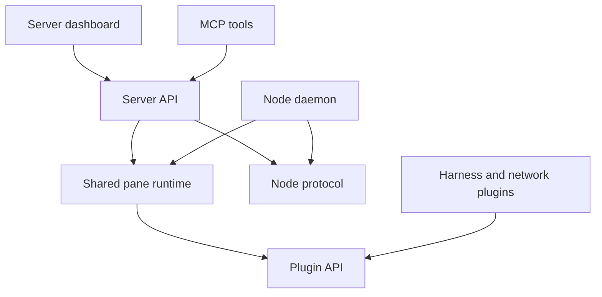

Build and test a contribution in the public Subshell repository.

## Before you start

Install Git and the Bun version required by the root `package.json` (at least `1.4.0`). Install tmux if you will run subshells or end-to-end tests. Desktop development also needs the platform's Tauri and Rust prerequisites; follow the owning desktop app's `AGENTS.md`.

Clone the [repository](https://github.com/subshell-ai/subshell) and install its dependencies:

```bash
git clone https://github.com/subshell-ai/subshell.git
cd subshell
bun install
```

Read root `AGENTS.md` and the owning app's `AGENTS.md` before editing. They describe build ordering, local workflows, and deeper engineering topics.

## Find the owning package

| Change | Location |
| --- | --- |
| API, authentication, persistence, or server CLI | `apps/server/api` |
| Dashboard UI | `apps/server/web` |
| Server setup desktop assistant | `apps/server/desktop` |
| Node daemon or node CLI | `apps/node/agent` |
| Desktop client and its node management window | `apps/client/desktop` |
| Plugin contract and test helpers | `packages/plugin-api` |
| Built-in harness or network adapters | `packages/plugins` |
| Shared launch and plugin runtime | `packages/pane-runtime` |
| Node wire protocol | `packages/subshell-protocol` |
| MCP server and tools | `packages/mcp-core` |
| Typed API client | `packages/backend-client` |
| Public documentation | `apps/docs` |



The arrows show code or API dependencies, not network encryption. Server means the control plane, node means an execution machine, and client means a person's interface.

## Run an isolated server

Use a temporary database, configuration directory, and tmux directory. Do not point scripted tests at your running instance on port `3080`.

First build the dashboard and its workspace dependencies from the repository root:

```bash
bunx turbo build --filter=@internal/server-web
```

In a dedicated terminal, start the API with isolated paths and a separate port:

```bash
docs_dev_root=$(mktemp -d)
mkdir -p "$docs_dev_root/config" "$docs_dev_root/data" "$docs_dev_root/tmux"
export SUBSHELL_SERVER_CONFIG_DIR="$docs_dev_root/config"
export SUBSHELL_SERVER_DATA_DIR="$docs_dev_root/data"
export TMUX_TMPDIR="$docs_dev_root/tmux"
export HOST=127.0.0.1
export SERVER_PORT=3200
export APP_BASE_URL=http://127.0.0.1:3200
export TRUSTED_ORIGINS=http://127.0.0.1:3200
export BETTER_AUTH_SECRET=$(bun -e 'process.stdout.write(crypto.randomUUID() + crypto.randomUUID())')
bun run --cwd apps/server/api dev
```

Open `http://127.0.0.1:3200` and complete setup with a sample administrator account. The API serves the built dashboard. API code changes restart the development process; dashboard changes need a new `@internal/server-web` build and a browser reload in this workflow.

These values configure the development server process. See [Files and paths](/reference/paths) for persistent service configuration and storage locations. The temporary directory contains test data and secrets; remove it only after stopping the test server and its subshells.

For the repository's normal watch workflow, `bun run start` starts the configured development tasks. It uses the normal service ports, so first check for conflicts with installed services. The dashboard's Vite proxy targets port `3080`; changing only `SERVER_PORT` does not retarget that proxy. The isolated workflow above uses the API's built dashboard instead.

## Run a specific interface

From the repository root:

```bash
bun run dev:desktop-server
bun run dev:desktop-client
bun run dev:docs
bun run dev:website
```

Desktop launchers prepare workspace builds and stage sidecars. They also check for stale installed copies and service conflicts. Read the owning app's instructions before using them against an installed service. Bare `tauri dev` can fail because the sidecar is absent or show an old installed binary.

The documentation preview uses port `3400`; the marketing site uses `3401`.

## Validate the change

Use the owning package's test script for focused work. Before submitting, run the appropriate broader checks from the repository root:

```bash
env -u SHELLOPTS -u BASHOPTS bun run test
bun run lint:check
bun run verify-types
bun run lint:licenses
```

Removing those shell options prevents automation shells from silently skipping Bash-based scripts. Capture a failing suite's output once and inspect that log; re-run after fixing the failure.

Rust changes also require `bun run rust:check`. For browser and process behavior, install Playwright's Chromium once and run the isolated end-to-end suite:

```bash
bunx playwright install chromium
bun run test:e2e
```

Read `e2e/AGENTS.md` first. Its stack starts its own backend on port `3199` with a temporary database. Do not use an already-running server at that port as the test target.

Documentation changes use the checks in [Write documentation](/developers/documentation). New database migrations need both a file in the migration directory and registration in the server's static migration map.

## Submit a contribution

Complete the one-time [CLA](https://github.com/subshell-ai/subshell/blob/main/CLA.md). Server implementations under `apps/server` are AGPL-3.0-only; other directories are Apache-2.0. An additional permission covers API type declarations, not server implementation. Moving a file across that boundary changes its license.

For a user-visible change, add a changeset for the app that ships it, or `@internal/docs` for documentation. Ignored packages cannot consume changesets; dashboard changes belong to the server app's changeset. Do not edit generated changelogs or create release tags by hand.

Describe the problem, resulting behavior, and validation in your pull request. Include material limitations so reviewers can assess the change.

## Next steps

Read [Write documentation](/developers/documentation), [Build a harness plugin](/developers/harness-plugin), or [Build an API integration](/automation/integrations).
