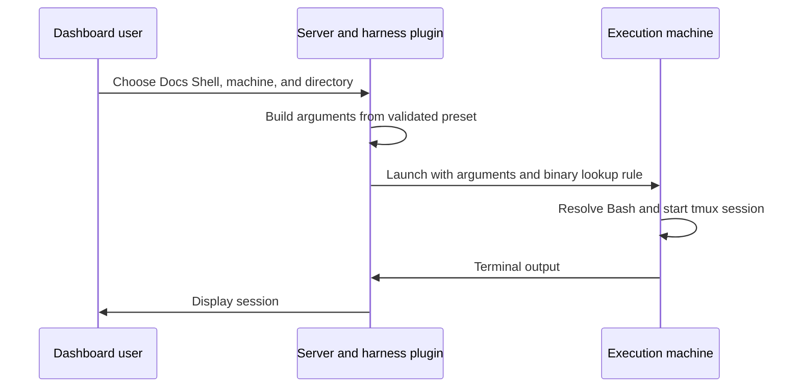

Build a working harness plugin that launches Bash with an optional login-shell setting.

## Before you start

Install Bun, have Bash available on the execution machine, and use an isolated Subshell instance for installation tests. You do not need an agent-provider account for this example.

Both `terminal` and `agent-harness` plugins implement `SubshellPlugin`. This example uses `terminal` because it launches a real shell. To support a coding agent, use `agent-harness`, declare its binary detection, and implement its actual CLI dialect. Changing the manifest type alone does not implement an agent integration.

Read [Plugin API](/developers/plugin-api) for the required methods and capability gates.

## Create the project

```bash
mkdir plugin-docs-shell
cd plugin-docs-shell
mkdir src test
```

Create these four files. The dependency package version and manifest API version are different numbers: this example uses package `3.0.0` and contract `apiVersion: 2`.

```json title="package.json"
{
  "name": "@example/plugin-docs-shell",
  "version": "1.0.0",
  "type": "module",
  "main": "dist/index.js",
  "files": ["dist"],
  "scripts": {
    "build": "bun build src/index.ts --outdir dist --target bun --format esm",
    "test": "bun test",
    "check": "tsc --noEmit"
  },
  "devDependencies": {
    "@subshell-ai/plugin-api": "3.0.0",
    "@types/bun": "1.3.14",
    "typescript": "7.0.2"
  },
  "subshell": {
    "apiVersion": 2,
    "id": "docs-shell",
    "type": "terminal",
    "name": "Docs Shell",
    "description": "Launch Bash with an optional login-shell setting.",
    "entry": "dist/index.js",
    "detect": {
      "binaryName": "bash",
      "envOverride": "DOCS_SHELL_PATH",
      "knownPaths": ["/bin/bash", "/usr/bin/bash"]
    }
  }
}
```

```json title="tsconfig.json"
{
  "compilerOptions": {
    "target": "ES2022",
    "module": "Preserve",
    "moduleResolution": "Bundler",
    "strict": true,
    "noEmit": true,
    "skipLibCheck": true,
    "types": ["bun"]
  },
  "include": ["src", "test"]
}
```

Use your own npm scope before publishing. Keep the manifest ID unique; it must not claim a built-in ID such as `terminal`.

## Implement the factory

```ts title="src/index.ts"
import {
  type HarnessPluginFactory,
  validateGenericPreset,
} from "@subshell-ai/plugin-api";

const createPlugin: HarnessPluginFactory = () => ({
  capabilities: () => ["settings"],

  buildCommand({ binary, preset, extraFlags }) {
    return [
      binary,
      ...(preset.settings?.login === true ? ["--login"] : []),
      ...preset.flags,
      ...(extraFlags ?? []),
      "-i",
    ];
  },

  validatePreset(preset) {
    const { issues } = validateGenericPreset(preset);
    const login = preset.settings?.login;
    if (login !== undefined && typeof login !== "boolean") {
      issues.push({ field: "settings", message: "Login must be a boolean." });
    }
    return { valid: issues.length === 0, issues };
  },

  presetSettings: () => [
    { key: "login", label: "Login shell", type: "boolean" },
  ],
});

export default createPlugin;
```

`buildCommand` returns separate arguments. A binary path containing spaces stays one argument; do not pre-quote it. The host quotes tokens when constructing the tmux launch command. The host sets the working directory and merges execution environment values.

`validatePreset` combines generic validation with the setting's own type check. The `settings` capability requires `presetSettings`. This plugin deliberately declares no MCP, attention, or resume capability because Bash does not implement those agent features.



## Test the behavior

```ts title="test/plugin.test.ts"
import { expect, test } from "bun:test";
import type { PresetDefinition } from "@subshell-ai/plugin-api";
import { createTestHost } from "@subshell-ai/plugin-api/testing";
import createPlugin from "../src/index";

const plugin = createPlugin(createTestHost());
const preset: PresetDefinition = {
  name: "Review shell", env: {}, flags: [], settings: null,
  configIsolation: false,
};

test("launches an interactive shell with ordered flags", () => {
  expect(plugin.buildCommand({
    binary: "/a path/bash", cwd: "/project", subshellName: "review",
    preset: { ...preset, settings: { login: true }, flags: ["--norc"] },
    extraFlags: ["--noprofile"],
  })).toEqual(["/a path/bash", "--login", "--norc", "--noprofile", "-i"]);
});

test("rejects invalid preset settings and keeps generic issues", () => {
  const result = plugin.validatePreset({
    ...preset, name: "", settings: { login: "yes" },
  });
  expect(result.valid).toBe(false);
  expect(result.issues.map(issue => issue.field)).toEqual(["name", "settings"]);
  expect(plugin.validatePreset(preset).valid).toBe(true);
});
```

Run in the plugin project:

```bash
bun install
bun run check
bun run test
bun run build
npm pack --dry-run
```

The tests should pass, and `dist/index.js` should contain the factory with the runtime validation helper bundled into it. The archive should contain `package.json` and `dist/index.js`. There must be no unresolved runtime import of `@subshell-ai/plugin-api` or a workspace package.

Follow [Publish a plugin](/developers/publish-plugin) for registry installation and compiled-server validation. In the isolated dashboard, choose **Subshells** → **New subshell**, select **Docs Shell**, select the execution machine and a sample directory, and launch. Enter `printf 'plugin works\n'` to confirm input and output. Close the test session when finished.

## Adapt the harness to an agent

Replace Bash detection with the agent's executable and verify flags against that CLI. Keep binary detection in manifest data so remote nodes can answer without loading plugin code. If you use an override variable, set it on the execution machine; [Files and paths](/reference/paths) explains its configuration layer.

Add features one at a time:

| Feature | What to implement and test |
| --- | --- |
| MCP | Render the agent's registration format in `mcpRegistration`, or supply manual `mcpSetup` steps. Pass supplied `mcp.args` into the launch; the host handles `mcp.env`. |
| Resume | Allocate a real conversation identity, compute its transcript path without filesystem access, and use `harnessSession.mode` to select the agent's start or resume arguments. |
| Attention hooks | Use the supplied reporter command and arguments in the agent's hook format. Omit hooks if no reporter is supplied. |
| Agent settings | Validate types and values, map them into arguments or configuration, and return matching editor fields. |

Do not assume Bun or a particular Subshell binary exists on a remote execution machine. `reporter` and the MCP launch specification are host-resolved for that machine. Use [Plugin API](/developers/plugin-api) for signatures and [built-in agent implementations](https://github.com/subshell-ai/subshell/tree/main/packages/plugins) for verified dialect examples.

## Next steps

Package and install the plugin with [Publish a plugin](/developers/publish-plugin). Test actual agent authentication, provider failures, conversation resumption, and remote-node launches before declaring those features supported.
