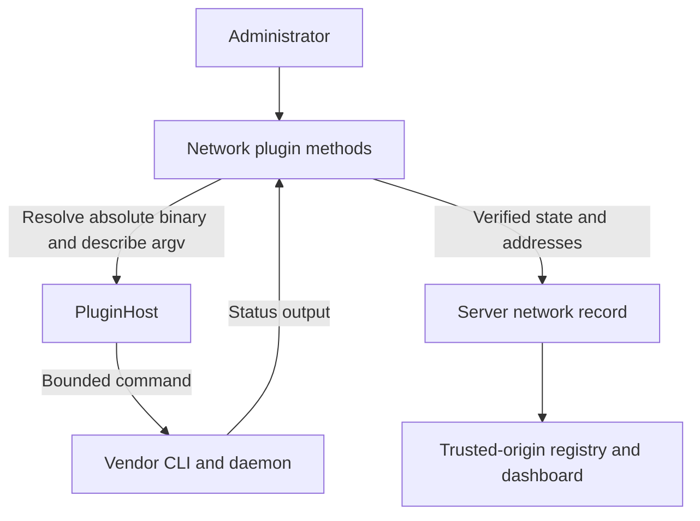
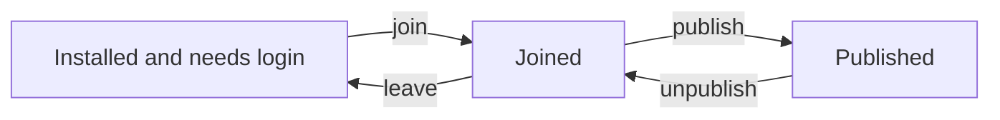

Build a network adapter and test its lifecycle against a scripted CLI fixture.

## Before you start

Install Bun and read [Plugin API](/developers/plugin-api). Network plugins run on the server host, not on enrolled nodes. They implement `NetworkPlugin`, whose required members are `capabilities`, `status`, `join`, and `leave`.

This tutorial uses a fictional `example-mesh` CLI with explicit fixture responses. It produces a compilable plugin and executable tests, but it does not create a VPN or verify a vendor service. Replace the fixture dialect with a real CLI and verify it on an isolated network before installing or publishing the adapter for users.

## Declare the package

Create `src` and `test` directories in a new `plugin-example-mesh` project. Use the same `tsconfig.json` as [Build a harness plugin](/developers/harness-plugin#create-the-project), then add:

```json title="package.json"
{
  "name": "@example/plugin-example-mesh",
  "version": "1.0.0",
  "type": "module",
  "main": "dist/index.js",
  "files": [
    "dist"
  ],
  "scripts": {
    "build": "bun build src/index.ts --outdir dist --target bun --format esm",
    "test": "bun test",
    "check": "tsc --noEmit"
  },
  "devDependencies": {
    "@subshell-ai/plugin-api": "3.0.0",
    "@types/bun": "1.3.14",
    "typescript": "7.0.2"
  },
  "subshell": {
    "apiVersion": 2,
    "id": "example-mesh",
    "type": "network",
    "name": "Example Mesh",
    "description": "Development adapter for a scripted mesh CLI.",
    "entry": "dist/index.js",
    "detect": {
      "binaryName": "example-mesh",
      "envOverride": "EXAMPLE_MESH_PATH",
      "knownPaths": [
        ".local/bin/example-mesh"
      ]
    },
    "network": {
      "platforms": [
        "linux",
        "darwin"
      ],
      "interactiveLogin": false,
      "exposure": "private"
    }
  }
}
```

`network.platforms` describes where the adapter can run. `exposure` is required: `private` means a restricted network, while `public-with-gate` means an internet-facing endpoint with an identity gate. These declarations must reflect the real network, not merely the URL scheme.

## Define the CLI boundary

The fixture contract is:

| Command | Response or effect |
| --- | --- |
| `status --json` | JSON containing boolean `joined` and `published`, plus `ipv4` when joined. |
| `join --key VALUE` | Joins the network; a following status must confirm membership. |
| `leave` | Leaves the network. |
| `publish --port PORT` | Publishes the server; a following status must confirm publication. |
| `unpublish` | Removes publication. |

The fixture distinguishes join from publish to exercise both methods. Some real private meshes already make the server reachable on join; their `publishImplicit` manifest behavior and address policy must match the vendor. Do not add a fictional publication step to a CLI that has none.

## Implement the adapter

```ts title="src/index.ts"
import { isIP } from "node:net";
import type {
  NetworkContext, NetworkPluginFactory, NetworkStatus,
} from "@subshell-ai/plugin-api";

const createPlugin: NetworkPluginFactory = host => {
  const binary = () => host.findBinary(
    "example-mesh", "EXAMPLE_MESH_PATH", [".local/bin/example-mesh"],
  );
  const unavailable = (text: string): NetworkStatus => ({
    state: "daemon-down", addresses: [], hints: [{ text }],
  });

  async function run(args: string[]) {
    const path = await binary();
    if (!path) throw new Error("Install the network CLI first.");
    const result = await host.run([path, ...args]);
    if (result.code !== 0 || result.timedOut || result.aborted) {
      throw new Error("The network CLI did not complete successfully.");
    }
    return result.stdout;
  }

  async function status(ctx: NetworkContext): Promise<NetworkStatus> {
    try {
      if (!await binary()) {
        return { state: "not-installed", addresses: [], hints: [] };
      }
      const value: unknown = JSON.parse(await run(["status", "--json"]));
      if (!value || typeof value !== "object") return unavailable("Invalid CLI status.");
      const data = value as Record<string, unknown>;
      if (typeof data.joined !== "boolean" || typeof data.published !== "boolean") {
        return unavailable("Unrecognized CLI status format.");
      }
      if (!data.joined) return { state: "needs-login", addresses: [], hints: [] };
      if (typeof data.ipv4 !== "string" || isIP(data.ipv4) !== 4) {
        return unavailable("The CLI did not report a valid mesh IPv4 address.");
      }
      return {
        state: data.published ? "published" : "joined",
        addresses: [{
          url: new URL(`http://${data.ipv4}:${ctx.port}`).origin,
          scheme: "http", label: "Example mesh IPv4", secureContext: false,
        }],
        hints: [],
      };
    } catch {
      return unavailable("Check the network daemon and its status output.");
    }
  }

  return {
    capabilities: () => ["publish"],
    status,
    async join(input, ctx) {
      if (!input.credential) throw new Error("A join credential is required.");
      await run(["join", "--key", input.credential]);
      const report = await status(ctx);
      if (report.state !== "joined" && report.state !== "published") {
        throw new Error("The CLI did not confirm network membership.");
      }
      return { state: "joined" };
    },
    async leave(ctx) {
      const report = await status(ctx);
      if (report.state === "not-installed" || report.state === "needs-login") return;
      await run(["leave"]);
    },
    async publish(ctx) {
      const before = await status(ctx);
      if (before.state !== "joined" && before.state !== "published") {
        return { refused: { text: "Join the network before publishing." } };
      }
      await run(["publish", "--port", String(ctx.port)]);
      const after = await status(ctx);
      if (after.state !== "published") {
        return { refused: { text: "The CLI did not confirm publication." } };
      }
      return { addresses: after.addresses };
    },
    async unpublish() {
      await run(["unpublish"]);
    },
  };
};

export default createPlugin;
```

Resolve an absolute executable through `host.findBinary`. Execute it only through `host.run`, which owns the deadline, output cap, environment allowlist, and privilege refusals. A nonzero exit is a result, not automatically an exception; the adapter decides what it means.

`status` converts ordinary failures into a state and hint instead of throwing. It validates the CLI output before constructing an address and derives the port from the current context on every call. Publication re-reads status before claiming success. Keep settings and membership out of factory-level mutable state so a server restart can reconstruct them.



## Exercise the lifecycle

```ts title="test/plugin.test.ts"
import { expect, test } from "bun:test";
import type { NetworkContext } from "@subshell-ai/plugin-api";
import { createScriptedHost, createTestHost } from "@subshell-ai/plugin-api/testing";
import createPlugin from "../src/index";

const ctx: NetworkContext = { port: 3199, settings: {}, secrets: { has: () => false } };
const joined = JSON.stringify({ joined: true, published: false, ipv4: "100.64.0.2" });
const published = JSON.stringify({ joined: true, published: true, ipv4: "100.64.0.2" });

test("missing binary and invalid CLI output stay actionable", async () => {
  expect((await createPlugin(createTestHost()).status(ctx)).state).toBe("not-installed");
  for (const stdout of ["not JSON", JSON.stringify({ joined: true }),
    JSON.stringify({ joined: true, published: false, ipv4: "evil.example" })]) {
    const host = createScriptedHost({ "/usr/bin/example-mesh status --json": { stdout } });
    expect((await createPlugin(host).status(ctx)).state).toBe("daemon-down");
  }
});

test("reports addresses using the current server port", async () => {
  const host = createScriptedHost({ "/usr/bin/example-mesh status --json": { stdout: joined } });
  const plugin = createPlugin(host);
  expect((await plugin.status(ctx)).addresses[0].url).toBe("http://100.64.0.2:3199");
  expect((await plugin.status({ ...ctx, port: 443 })).addresses[0].url)
    .toBe("http://100.64.0.2:443");
});

test("join verifies membership and leave uses the host", async () => {
  const host = createScriptedHost({
    "/usr/bin/example-mesh join": {},
    "/usr/bin/example-mesh leave": {},
    "/usr/bin/example-mesh status --json": { stdout: joined },
  });
  const plugin = createPlugin(host);
  expect(await plugin.join({ credential: "fixture-key" }, ctx)).toEqual({ state: "joined" });
  await plugin.leave(ctx);
  expect(host.calls.map(argv => argv[1])).toContain("leave");
});

test("publication requires membership and post-action confirmation", async () => {
  const host = createScriptedHost({
    "/usr/bin/example-mesh status --json": { stdout: joined },
    "/usr/bin/example-mesh publish": {},
  });
  expect(await createPlugin(host).publish!(ctx)).toHaveProperty("refused");
  const missing = createScriptedHost({
    "/usr/bin/example-mesh status --json": {
      stdout: JSON.stringify({ joined: false, published: false }),
    },
  });
  expect(await createPlugin(missing).publish!(ctx)).toHaveProperty("refused");
  expect(missing.calls.some(argv => argv[1] === "publish")).toBe(false);
});

test("publish and unpublish preserve the host-owned lifecycle", async () => {
  const host = createScriptedHost({
    "/usr/bin/example-mesh status --json": { stdout: published },
    "/usr/bin/example-mesh publish": {},
    "/usr/bin/example-mesh unpublish": {},
  });
  const plugin = createPlugin(host);
  expect(await plugin.publish!(ctx)).toEqual({ addresses: [{
    url: "http://100.64.0.2:3199", scheme: "http",
    label: "Example mesh IPv4", secureContext: false,
  }] });
  await plugin.unpublish!(ctx);
  expect(host.calls.at(-1)).toEqual(["/usr/bin/example-mesh", "unpublish"]);
});

test("a failed vendor command does not become a successful join", async () => {
  const host = createScriptedHost({ "/usr/bin/example-mesh join": { code: 1 } });
  await expect(createPlugin(host).join({ credential: "fixture-key" }, ctx)).rejects.toThrow();
});
```

Run in this plugin's directory:

```bash
bun install
bun run check
bun run test
bun run build
npm pack --dry-run
```

These tests verify parsing, missing installation, invalid address data, current-port handling, join confirmation, publication refusal, command failure, and unpublication. They do not prove real network reachability or a vendor's authentication flow. Add captured, nonsensitive fixtures for the supported vendor versions and verify the real lifecycle before distribution.



## Add credentials, settings, or supervision

`NetworkContext` supplies `port`, current non-secret `settings`, and secret-presence checks. Persistent secrets use `host.secrets.set`, `has`, and `delete`; there is no `get`. Secret files are permission-protected, not encrypted at rest. The example join key is transient argv and can be visible to local process inspection; do not log it or persist it in settings.

A long-running child belongs in `supervisedProcess(ctx)`. Return an absolute `command`, `args`, and optional `secretFileArgs` or `secretEnv` naming stored secrets. The host injects values and owns the child lifecycle. Declare `supervise`, and reconstruct the specification at boot from the current context.

For public exposure, declare `guard` and return `requestGuard(ctx)` as well as verifying publication prerequisites. The implemented guard kind is `cloudflare-access`, with `hostname`, `teamDomain`, and `aud`; the contract is not an arbitrary request-middleware hook. See [Cloudflare Tunnel](/networking/cloudflare) and [Security model](/concepts/security).

Privileged setup belongs in `network.privileged` as instructions the UI prints for a person. `install.command` is a runnable, unprivileged installer; privilege-elevation commands at shell boundaries are refused. `host.run` also refuses elevation binaries. Do not spawn children or write `config.env` yourself.

Report canonical HTTP(S) origins and safe HTTP(S) hint links. Enabled plugin records contribute addresses to the live trusted-origin registry; they do not overwrite the administrator's explicit origins. `secureContext` describes browser eligibility for features such as passkeys, not whether the network itself encrypts transport.

## Validate a real integration

Before publishing, test installation, daemon downtime, permission denial, login, joining, leaving, publication, disabling, uninstalling, and restarting the server while published. Confirm that unpublish stops reachability and that restarting restores the required guard before serving a public hostname. See [Publish a plugin](/developers/publish-plugin) for the package and installation workflow.
