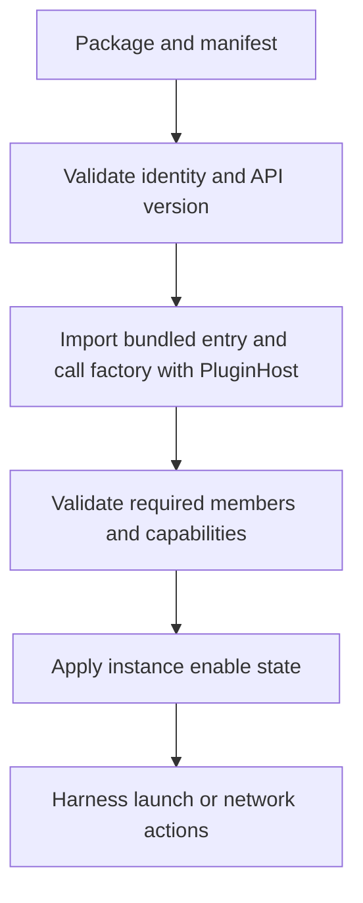

Implement plugins against the published `@subshell-ai/plugin-api` contract.

## Choose a plugin type

| Manifest type | Returned interface | Runs or configures |
| --- | --- | --- |
| `agent-harness` | `SubshellPlugin` | An agent CLI in a session on the selected execution machine. |
| `terminal` | `SubshellPlugin` | A shell or other non-agent program in a session. |
| `network` | `NetworkPlugin` | A network connection or publication on the server host. |

Types group plugins for people and select the required interface. Capabilities opt into supported features. Installing a harness does not install its executable on every node.

Start with [Build a harness plugin](/developers/harness-plugin) for a runnable shell example or [Build a network plugin](/developers/network-plugin) for a fixture-tested network adapter.

## Manifest contract

The package's `package.json` contains a `subshell` object:

| Field | Meaning |
| --- | --- |
| `apiVersion` | Contract version required by the plugin. The implemented manifest API version is `2`. |
| `id` | Stable plugin ID, unique within an instance. Do not claim another package's or built-in plugin's ID. |
| `type` | One of the three types above. |
| `name`, `description` | Human-facing identity and explanation. |
| `entry` | Path to the bundled ESM factory, relative to the package. |
| `detect` | Binary name, environment override, and known paths used for manifest-driven detection. |
| `install` | Optional unprivileged installation command and documentation link. This is not a plugin package dependency installer. |
| `hostEnv` | Optional names of execution-host environment values needed for path computation. |
| `network` | Required for network plugins: supported platforms, exposure, login behavior, and optional privileged instructions. |

Known paths can be absolute or HOME-relative. Keep detection data in the manifest so a remote machine can locate a binary without loading plugin code. Prefer canonical HTTP(S) documentation URLs; unsupported schemes are refused in manifest links.

Network privilege instructions live under `network.privileged`, keyed by platform. Each step has `label`, `command`, and optional `docsUrl` and `group`. Steps with the same `group` form an ordered sequence; different groups are alternative installation routes. Omit `group` for one plain sequence. These commands are displayed for the operator to run; `install.command` is the separate unprivileged command the host can execute.

Only HTTP(S) URLs are accepted in `docsUrl`. An invalid manifest URL prevents loading. An invalid URL in a runtime hint is removed while its message remains visible. Use the exported `isDocsUrl` helper to validate links obtained from vendor output before returning them.

The npm package version is independent of `apiVersion`. Package `3.0.0`, used by the tutorials, still exposes manifest API `2`. A host implementing a lower API version refuses the manifest. A higher host version does not guarantee an older interface works: required members and capabilities are checked at load. Rebuild and test across contract changes.

## Factory and loading

The ESM entry default-exports a factory. Use the type matching your interface:

```ts
import type {
  HarnessPluginFactory,
  NetworkPluginFactory,
} from "@subshell-ai/plugin-api";
```

`HarnessPluginFactory` receives `PluginHost` and returns `SubshellPlugin`. `NetworkPluginFactory` returns `NetworkPlugin`. `PluginFactory` is their union, useful for a loader; using the narrower factory in your implementation keeps tests correctly typed.



Runtime-installed plugin code runs in the server process with its OS privileges. It is not sandboxed. The host service restrictions guide supported behavior; a malicious plugin can bypass them using process privileges. See [Security model](/concepts/security).

## Required harness members

| Member | Signature or return | Responsibility |
| --- | --- | --- |
| `buildCommand` | `(input: BuildCommandInput) => string[]` | Return separate argv elements beginning with the supplied resolved binary. |
| `validatePreset` | `(preset: PresetDefinition) => PresetValidationResult` | Return `{ valid, issues }`; each issue has `field` and `message`. |
| `capabilities` | `() => PluginCapability[]` | Declare implemented optional features. |

`PresetDefinition` has `name`, `env`, `flags`, `settings`, and `configIsolation`, plus optional `description` and `restartOnExit`. `validateGenericPreset` checks common fields; add your own setting validation.

`BuildCommandInput` provides:

| Field | Use |
| --- | --- |
| `binary`, `cwd` | Resolved executable and target-machine working directory. The host applies the directory. |
| `preset`, `extraFlags` | Saved configuration and additional launch arguments. |
| `subshellName` | Display name, or an empty string when no name is supplied. |
| `mcp` | Optional rendered registration. Consume `args`; the host applies its `env`. |
| `harnessSession` | Optional conversation `id` and `mode`, either `start` or `resume`. |
| `reporter` | Optional host-resolved reporting command and arguments for execution on the pane's machine. |

Return argv without pre-quoting. The host handles quoting at the tmux shell boundary. Do not substitute the server's filesystem or executable paths for target-machine information.

### MCP, resumption, and reporting

`mcpRegistration(launch, configPath)` returns `fileContent` and optional `args` and `env` in the agent's configuration dialect. `McpLaunchSpec` contains a resolved `command` and `args` for the stdio MCP server. Alternatively, `mcpSetup(launch)` returns automatic guidance or manual setup steps.

Resume support supplies `allocateHarnessSessionId()` and `resumePath(id, cwd, hostEnv)`. The latter is a pure path computation; the host checks existence on the execution machine. Use the supplied conversation ID in both new and resumed launches rather than generating a second unrelated identity.

Attention hooks require `supportsAttentionHooks: true` and actual reporting hooks in the launch. Build those from `reporter.command` and `reporter.args`; omit hooks when it is absent. Do not assume the execution machine has Bun or the server's binary path.

Other optional members include `parseVersion`, `exitStatus`, `presetSettings`, `suggestedEnv`, and `suggestedFlags`. See the [exported types](https://github.com/subshell-ai/subshell/blob/main/packages/plugin-api/src/types.ts) for complete field definitions.

## Required network members

| Member | Signature or return | Responsibility |
| --- | --- | --- |
| `status` | `(ctx: NetworkContext) => Promise<NetworkStatus>` | Report verified state, addresses, and actionable hints. Routine vendor failures should not throw. |
| `join` | `(input: JoinInput, ctx) => Promise<JoinOutcome>` | Confirm membership or return an interactive login URL and optional code. |
| `leave` | `(ctx) => Promise<void>` | Leave membership, treating an already-left network as an ordinary condition. |
| `capabilities` | `() => PluginCapability[]` | Declare the implemented optional network features. |

`NetworkContext` supplies the current server `port`, non-secret `settings`, and `secrets.has(name)`. Re-read context on every call. A factory must not remember a publication port or settings value across calls.

`NetworkStatus` contains `state`, `addresses`, and `hints`, with optional login and identity information. States are `not-installed`, `daemon-down`, `needs-privilege`, `needs-login`, `joined`, and `published`. Unsupported operating systems come from manifest platform data rather than another status value.

A `NetworkAddress` has canonical origin `url`, `scheme`, human-facing `label`, and `secureContext`. The last field reports browser secure-context eligibility, not the mesh's transport encryption. `PublishOutcome` returns `addresses` and an optional supervised `process`; `PublishRefusal` returns `{ refused: NetworkHint }`.

## Capability requirements

| Capability | Harness requirement | Network requirement |
| --- | --- | --- |
| `settings` | `presetSettings()` | `settingsFields()` |
| `mcp` | `mcpRegistration` or `mcpSetup` | Not applicable. |
| `resume` | Both members of `resume` | Not applicable. |
| `attention` | `supportsAttentionHooks: true`, with hooks implemented | Not applicable. |
| `publish` | Not applicable. | Both `publish()` and `unpublish()`. |
| `supervise` | Not applicable. | `supervisedProcess(ctx)`. |
| `guard` | Not applicable. | `requestGuard(ctx)`. |

A mismatched capability or missing required method makes the plugin fail loading. Do not declare a feature to obtain a UI control before implementing it.

## Host services

| Service | Contract and constraints |
| --- | --- |
| `findBinary(name, envOverride, knownPaths)` | Resolve an executable or return `null`. |
| `detectBinary(...)` | Resolve an executable with a reason when unavailable. |
| `probeVersion(binary, args?)` | Run a bounded probe and return trimmed output or `null`. |
| `shellQuote(value)` | Quote one token when you must build an agent hook's shell command. Do not apply it to ordinary argv. |
| `log.debug`, `log.warn` | Namespaced diagnostics; never log secrets. |
| `run(argv, opts?)` | Execute an absolute-path command with bounds and an allowlisted environment. Inspect `code`, `stdout`, `stderr`, `timedOut`, and `aborted`. |
| `secrets.set`, `has`, `delete` | Per-plugin persistent secret storage; no value-reading API. |
| `platform`, `homeDir`, `apiVersion` | Server-host context and implemented contract version. |

`run` accepts options such as `timeoutMs`, `onLine`, `signal`, extra `env`, and `stdin`. Nonzero process exits are returned, not automatically thrown. Invalid executable paths or privilege-elevation commands are plugin errors and are refused. Long-running processes belong in `supervisedProcess`, not `run`.

Persistent secrets live in permission-protected files under the server's data directory, not encrypted storage. A supervised process can name secrets using `secretFileArgs` or `secretEnv`; the host supplies the values. These files are separate from replaceable plugin code. See [Files and paths](/reference/paths).

## Testing and bundling

Import `createTestHost` or `createScriptedHost` from `@subshell-ai/plugin-api/testing`. Override the services you rely on; assert emitted arguments, parse failures, and refused operations as well as success.

Bundle all third-party runtime dependencies, including contract helpers. A compiled server has no adjacent workspace `node_modules` for bare imports to resolve. Node built-ins are permitted; external package imports need to be inlined. The tutorials use `bun build --target bun --format esm` and verify the packed output against the compiled loader.

See [Publish a plugin](/developers/publish-plugin) for archive inspection, registry requirements, installation, and troubleshooting.
