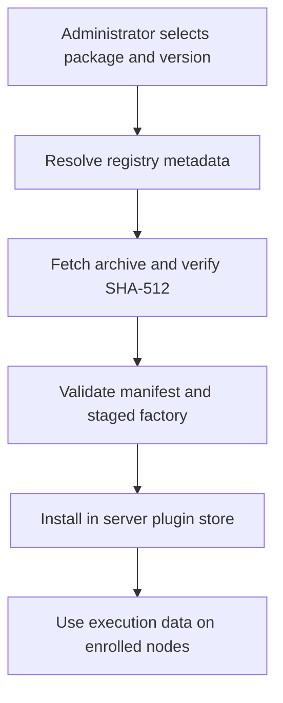

Package your plugin for installation through the server dashboard.

## Before you start

Complete [Build a harness plugin](/developers/harness-plugin) or [Build a network plugin](/developers/network-plugin). Use your own package name and a unique manifest ID. You need an npm account or an npm-compatible registry to distribute the package, and an administrator account on an isolated Subshell instance to test installation.

> [!warning] Server privileges
> Installing a plugin executes its code in the server process without a sandbox. Review dependencies and packed code before installation. A plugin can reach the server's credentials and enrolled nodes with the server's privileges.

## Build and inspect the archive

Run these commands in your plugin project:

```bash
bun install
bun run check
bun run test
bun run build
npm pack --dry-run
npm pack
```

For the tutorial packages, the archive must contain `package/package.json` and `package/dist/index.js`. Include any additional runtime assets in the package's `files` list. Exclude credentials, logs, and unrelated project files.

Inspect the generated archive using its actual filename:

```bash
tar -tzf example-plugin-docs-shell-1.0.0.tgz
tar -xOf example-plugin-docs-shell-1.0.0.tgz package/package.json
```

Check that `subshell.entry` names the bundled file and that the manifest API version matches the host contract. In these examples, package `@subshell-ai/plugin-api@3.0.0` exposes manifest API `2`; the two versions are independent.

All third-party runtime dependencies must be bundled. The compiled server does not provide neighboring `node_modules` for a plugin to resolve. A build that leaves `import ... from "some-package"` in the output needs additional bundling. Node built-ins such as `node:net` can remain imports.

## Publish to a registry

Replace the tutorial's `@example` scope with a scope you own. For a public scoped npm package, publish the inspected build from the project directory:

```bash
npm publish --access public
```

This command publishes externally; run it only when you intend to release the package. Follow your registry's authentication requirements and review the archive before publishing.

Subshell accepts a package name, an exact version, or a distribution tag:

```text
@your-scope/plugin-docs-shell
@your-scope/plugin-docs-shell@1.0.0
@your-scope/plugin-docs-shell@next
```

It does not accept semver ranges, local directories, `file:` specifications, Git URLs, or tarball URLs as install specifications. A local `npm pack` archive is an inspection artifact, not a dashboard installation source.

The registry must provide npm-compatible package metadata, a tarball URL, and `dist.integrity` using SHA-512. Subshell verifies that digest before extraction and checks the manifest and factory before replacing installed code. Integrity confirms that the archive matches the registry metadata; it is not a publisher signature or a security review.

For local distribution testing, serve the package through an npm-compatible test registry. On the isolated server host, configure `SUBSHELL_PLUGIN_REGISTRY_URL` and restart the server. See [Files and paths](/reference/paths) for the server's configuration file. This setting affects registry installs across the instance; avoid changing it on a production server for a tutorial.

## Install on an isolated instance

1. Sign in as an administrator to the isolated server dashboard.
2. In the sidebar, open **Server Settings** → **Plugins**.
3. In **Install from npm**, enter your package specification, preferably an exact version for a repeatable test.
4. Enter the manifest's ID in **Plugin id**, such as `docs-shell` for the Bash example.
5. Select **Install** and review the third-party code confirmation.
6. Verify that the plugin appears without a load error and is enabled.

A package cannot replace a built-in implementation by claiming its ID. The package's manifest ID must match the requested ID. Installed code lives under the server data directory's `plugins` folder; persistent plugin state lives separately. See [Files and paths](/reference/paths).



The server owns plugin code. A remote node receives detection and launch data; it does not need a second package installation.

## Verify behavior from the installed package

Test the packed package against a compiled Subshell server, not only the source checkout. This catches dependencies that resolve accidentally from the repository.

For the Bash example:

1. Confirm Bash is installed on the execution machine.
2. In the dashboard sidebar, open **Presets** → **New preset** and choose **Docs Shell**.
3. Save a preset with the login-shell setting enabled.
4. Open **Subshells** → **New subshell**, choose that preset, and select an accessible working directory and online node.
5. Confirm that the shell starts. Run `printf 'plugin works\n'` in its pane and inspect the output.
6. Close the test subshell when finished. **Close** deletes its session record and captured history.

Also test a remote node, a missing executable, invalid preset values, and the capability behavior you advertise. The network tutorial uses a fictional CLI fixture; a real network plugin additionally needs tests against its actual vendor CLI, including leave, unpublish, failures, and any privileged setup instructions.

## Diagnose installation failures

| Symptom | Check |
| --- | --- |
| Package cannot be resolved | Registry URL, package spelling, exact version or tag, and registry access. |
| Missing integrity or digest mismatch | Registry metadata and the bytes served by its tarball URL. Do not bypass verification. |
| Wrong plugin ID | Requested **Plugin id** and `subshell.id` in the packed manifest. |
| Entry cannot load | Archive paths, ESM output, and unbundled runtime dependencies. |
| Missing method or invalid capability | Required interface and capability requirements in [Plugin API](/developers/plugin-api). |
| Installed harness cannot launch | Executable detection on the selected machine, preset validation, directory access, and argv construction. |
| Replacement remains stale | Restart the isolated server when the plugin reports that a restart is required; imported modules are cached. |

## Maintain the package

Keep the manifest ID stable, publish new package versions, and document changes to dependencies, permissions, settings, and agent CLI support. Re-run packed-package and compiled-host checks after upgrades. Do not claim compatibility with host or vendor versions you have not tested.

## Next steps

Read [Plugins](/administration/plugins) for administrator operations and [Plugin API](/developers/plugin-api) for the complete contract.
