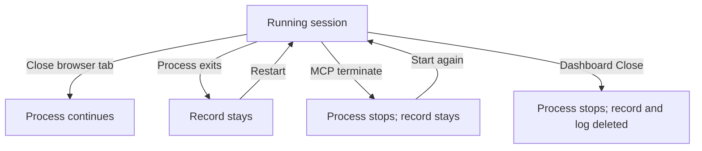

Manage a subshell's process and stored history without confusing them with browser tabs.

## Process and record lifecycle

Retained logs are subject to retention limits. Restarting a session does not guarantee that its agent can resume a conversation.

## Disconnect a viewer

Closing a browser tab disconnects that viewer. It does not stop the agent or remove the subshell. The machine must remain running for its process to continue.

## Restart a session

When a process exits, the subshell may remain listed with `status: "running"` and `alive: false`. In the server dashboard's sidebar, choose **Subshells**, open the session's **⋯** menu, and choose **Restart** to revive it in place. A terminated subshell offers **Start again**.

A restart keeps the subshell ID and launches from its stored harness, preset, and directory. Conversation resumption depends on harness support and the survival of the agent's transcript. Credentials rotate on restart.

## Close permanently

> [!warning] Permanent removal
> **Close** stops the process and removes the subshell's row and captured history. The confirmation states that it cannot be recovered.

To close a session you own, open its **⋯** menu on the **Subshells** page and choose **Close**. Only the owner can close a subshell. Removing a subshell also removes its workspace pane references. This does not delete the project's files or the agent CLI's separate conversation storage.

## Stop while retaining the row

MCP's `terminate_subshell` and the REST terminate endpoint stop the process and retain its row. Their delete operations remove it. The dashboard's **Close** action permanently deletes the subshell.

Captured logs of retained terminated subshells are subject to the retention settings listed in [Environment variables](/reference/environment).

## Next steps

Read [Helper lifecycle](/mcp/lifecycle) when agents create sessions on your behalf.
