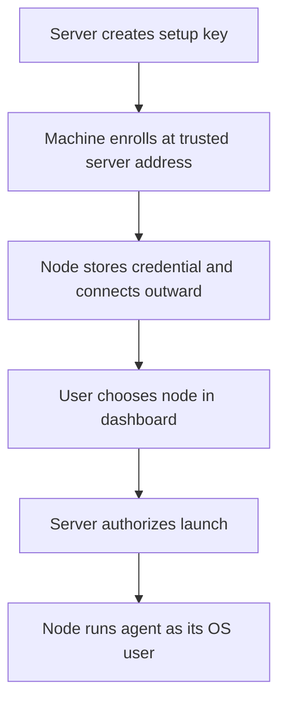

Enroll other machines so your server can launch agents on them.

A node runs the `subshell` daemon. It connects outward to the server, receives signed commands, and sends terminal output back. Your browser continues to connect to the server.

## Add a machine

Use **Subshell Client** for most node installations. It bundles the node binary and provides the enrollment and management window.

- [Desktop node setup](/nodes/desktop) is the recommended path for a machine with a desktop environment.
- [Enroll a node with the CLI](/nodes/enroll) covers headless machines and terminal-based setup.
- [Proxmox nodes](/nodes/proxmox) creates a dedicated execution container.

### Enrollment and execution

The setup key enrolls the machine; the node then uses its own credential for its connection. A browser-only device does not need enrollment.

## Control access

[Directory restrictions](/nodes/directories) limit where new sessions can launch. [Share a node](/nodes/sharing) controls which users can run sessions there.

> [!warning] Enrollment trust
> Enrolling a machine delegates agent execution to the control plane. Agents run with the node account's permissions; command signing does not sandbox their filesystem access.

## Operate a node

Use [Manage a node](/nodes/manage) for runtime and log details, [Node services](/nodes/service) for persistence, and [Node maintenance](/nodes/maintenance) before disruptive work.

For relocation or removal, read [Repoint a node](/nodes/repoint) and [Unenroll a node](/nodes/unenroll).
