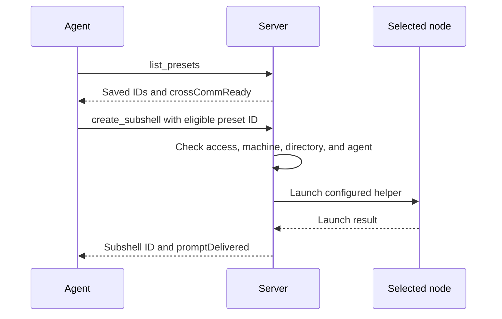

Reuse a saved preset when starting another subshell.

## Launch from the dashboard

1. In the server dashboard sidebar, open **Subshells** and select **New subshell**.
2. Choose the agent and your saved preset.
3. Review the machine, working directory, and prompts filled from the preset. Change them for this launch if needed.
4. Launch and confirm that the agent reaches its normal prompt.

Changing a field in the launch form changes that launch; it does not update the saved preset. See [Launch a subshell](/guides/launch).

## Edit or clone

In the dashboard sidebar, open **Presets** and select a preset's name to edit it. Change its values and select **Save**. Existing processes keep their launch-time configuration.

To keep the original, open the preset row's **⋯** menu and choose **Clone preset**. Give the copy a distinct name and review its values before saving. The agent stays the same; create a new preset to choose a different agent.

Use [Clone and switch presets](/guides/clone) for actions on an existing subshell rather than on the library entry.

To remove a library entry, choose **Delete preset** from its **⋯** menu and review the confirmation. Existing subshell records remain, but their association with that preset is cleared. Keep any configuration you need before deleting it.

## Use from an agent

MCP's `list_presets` returns your saved preset IDs and `crossCommReady`. A preset is ready for agent-created launches only when its MCP switch is enabled and a machine and directory are saved. Catalog entries are not saved presets: an agent harness catalog entry needs a saved preset before `create_subshell` can launch it, while a plain terminal harness can launch presetless (see [Terminal sessions](/mcp/terminals)).

Choose an ID from `list_presets`; do not guess one from the display name. An agent's task can append to the preset's saved prompt or replace it using `prompt_mode`. Check `promptDelivered` when an initial task was requested; a created session does not prove that task arrived.

The agent that creates a helper must clean it up when the work is done. Follow [Coordinate agents](/mcp/coordinate).

## Next steps

Build task text with [Reusable Prompts](/prompts) or review [MCP tool reference](/mcp/tools).
