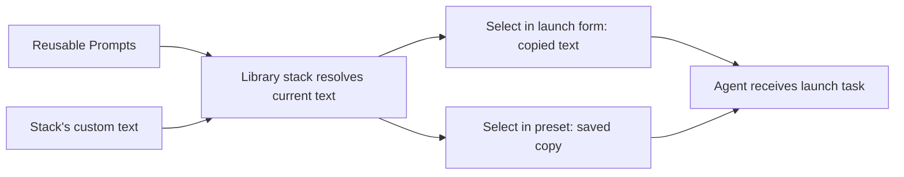

Group instructions into an ordered reusable stack.

## Before you start

Create the prompts you want to combine, or have access to shared prompts. A stack can include library prompts and its own custom text. It cannot contain another stack.

## Create a stack

1. In the server dashboard sidebar, open **Prompts** and choose your own entries.
2. Select **New** → **New stack**.
3. Enter a descriptive **Label**, such as `Repository review checklist`.
4. Under **Prompts**, select **Add prompt** and choose a library prompt or **Write your own...**.
5. Repeat for the other instructions. Use the up and down controls to put them in the intended order.
6. Leave **Share with everyone** off for a private stack, then select **Create stack**.

A stack needs at least one instruction when created, supports at most 50 items, and must fit the 20,000-character limit after joining its text with blank lines. For example, combine project context, review instructions, and a report format in that order.

<figure className="docs-screenshot">
  <ImageZoom src="/screenshots/prompt-stack-members.png" alt="Expanded Repository review checklist with Project context, Review changes, and Review report format in numbered order." width="830" height="251" loading="lazy" decoding="async" unoptimized />
  <figcaption>Expand a stack in the Prompts library to inspect its members in the order they will be combined. Select the image to enlarge it.</figcaption>
</figure>

## References and copies

A library stack references its saved prompts. Editing one of those prompts changes the text returned by the stack the next time it is read. Custom text belongs to the stack itself.

Selecting a stack in a launch form or preset copies its combined text. Later library changes do not update that selection or an already-running agent.

To refresh a preset, remove its old prompt block, select the library entry again, and save the preset. Recheck its text before launching.

## Edit or delete

In **Prompts**, choose **Stacked**, find one of your stacks, and open its **⋯** menu. Choose **Edit** to change the label or membership and select **Save**. An existing stack can be emptied; **Empty** helps find those stacks in your own stacked view.

Deleting a stack keeps its saved prompts. Deleting a saved prompt removes that reference from every stack and may leave a stack empty. Deletion has no undo. Nothing already launched is rewritten.

Sharing a stack does not make its private referenced prompts public. See [Share prompts](/prompts/sharing) for how each reader's visibility affects the result.

## Next steps

Follow [Use a reusable prompt](/prompts/use) to select your stack at launch or in an active session.
