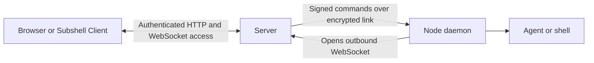
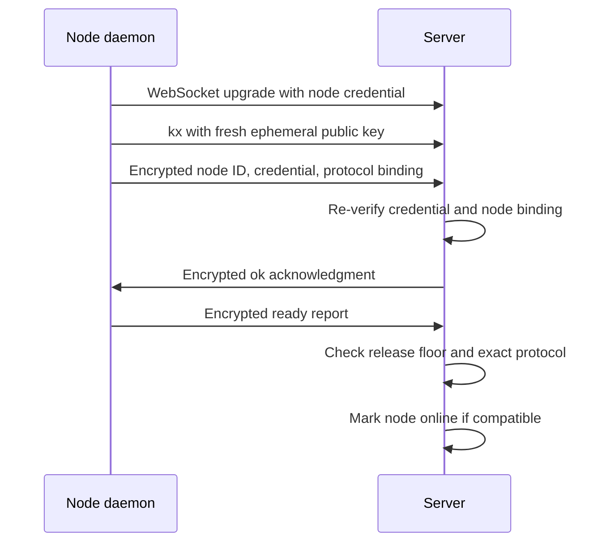
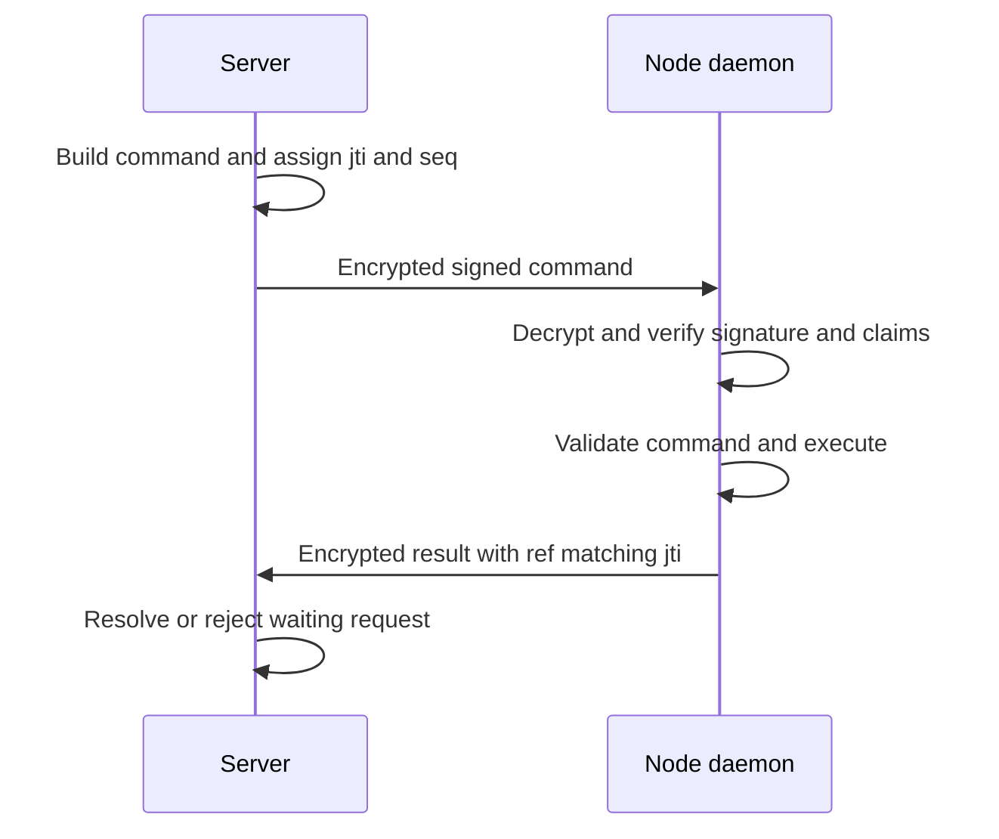
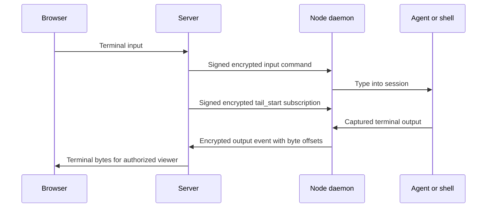

Understand how an enrolled node authenticates, receives work, and reports session output to its server.

## Scope and transport

The node daemon opens an outbound WebSocket connection to the server's `/ws/node` endpoint. The server uses that connection for commands; the node uses it for results, machine reports, terminal output, and process-exit events. Browsers connect to the server, so they do not need direct access to a node's ports.

This protocol is an internal contract between the server and node releases. It is separate from the browser API and MCP tool interface. Use [REST API](/automation/rest-api) or [MCP tool reference](/mcp/tools) for external integrations.

No public node listener is required for this connection. The node's separate loopback management dashboard is not the server-to-node transport; see [Node CLI](/reference/node-cli) and [Security model](/concepts/security).

## Enrollment and identity

Enrollment redeems a single-use setup key for a persistent node ID and node credential, along with the server's public signing identity. The node stores its connection and identity state in its local configuration. [Files and paths](/reference/paths) identifies that file and the associated key storage.

Three identities serve different purposes:

| Identity | Purpose |
| --- | --- |
| Node credential | Authenticate the WebSocket upgrade and prove the same credential inside the encrypted link. It is not a REST API credential. |
| Server signing public key | Verify that commands were signed by the trusted control plane. |
| Link encryption public keys | Pin the endpoints used for application-layer encryption. These are distinct from the command-signing identity. |

Changing the server address preserves the node's identity and trust state. It is suitable for another address of the same server. Joining a different server requires enrollment there; changing a URL does not make its signing keys interchangeable. Repointing also sends the node credential to the newly named host, so use a trusted address. See [Repoint a node](/nodes/repoint).

## Connection setup

For a paired node, connection setup proceeds as follows:

1. The daemon connects to `/ws/node` with its node bearer credential. The server checks the credential, node record, and owner's enabled state before admitting it.
2. The node sends a `kx` frame with a fresh ephemeral public key. It derives connection keys using the server encryption key it already trusts.
3. The server derives its side of the connection keys. It does not send a plaintext key-exchange reply.
4. The node sends an encrypted binding containing its node ID, node credential, and protocol version. The server re-verifies that the credential belongs to the node admitted at upgrade.
5. The server sends an encrypted `ok` acknowledgment.
6. The node sends its encrypted `ready` report. The server applies release-version and protocol gates before marking it online.

Connection keys use libsodium `crypto_kx`; established traffic uses `crypto_secretstream_xchacha20poly1305`. Commands and events are carried in encrypted binary WebSocket frames. A broken stream or unexpected plaintext frame ends the encrypted connection rather than causing a fallback to plaintext.

The encrypted handshake has a 10-second deadline. An open socket with an incomplete handshake is not eligible for ordinary commands.

### Pairing a node without an encryption pin

A node record without a pinned encryption identity uses a registration flow. The node sends `register` with its public encryption key. The server records the pin, returns `register-ok` with its public encryption key, and closes that socket normally. The node saves the returned identity and reconnects through the encrypted handshake above.

Registration is a pairing operation, not normal execution over plaintext. The node credential and enrollment address are its trust root. Protect enrollment with trusted network access and HTTPS where appropriate; encryption after pairing does not independently authenticate the first server address.

## Readiness and machine reports

The `ready` event identifies the node's release version, protocol version, operating system, architecture, hostname, data directory, and capabilities. It can also report its home directory, invocation path, runtime and service details, and maintenance state.

These reports let the server plan launches for the execution machine rather than guessing its paths from the server host. They can disclose machine names, local paths, and selected environment information to the trusted control plane.

The server requests binary detection using `detect` with manifest-derived detection rules and named environment variables. The node returns raw detection results; the server's plugins interpret them. Nodes do not download or load a separate harness plugin set. Cached detection information while offline does not prove a binary is still available or that the node can launch work.

## Signed commands and results

The server wraps each command in a compact JWS signed with **ES256**. The claims include:

| Claim | Check |
| --- | --- |
| `iss` | Expected control-plane issuer, `subshell-control`. |
| `aud` | The specific target node ID. |
| `iat` and `exp` | Freshness and a 30-second command lifetime. |
| `jti` | Single-use command identifier for replay checks and result correlation. |
| `seq` | Connection-local ordering. It is not a substitute for replay detection. |
| `cmd` | Structurally validated command body. |

The signed envelope is then encrypted for the node connection. Signing authorizes the command and binds its target; encryption protects the bytes in transit. Neither prevents a trusted or compromised server from requesting real program execution.

The daemon decrypts the frame, verifies the signature and claims, validates the command body, and dispatches it. Verification is ordered per connection. Replay tracking survives reconnects; connection-local sequence tracking resets for a new connection.

A success event has `type: "result"`, `ref`, `ok: true`, and optional `data`. A refusal has `ok: false` and an `error` string. Node events inherit the authenticated encrypted connection's identity; they are not separately JWS-signed commands.

The server normally waits up to 10 seconds for a command result. Updates use a five-minute deadline. The command's signature expiry governs acceptance, not the maximum duration of an already-accepted operation. A timeout does not prove that the node performed no work; inspect state before retrying an operation that could create or change something.

### Command families

| Purpose | Command types |
| --- | --- |
| Session processes | `launch`, `terminate`, `kill`, `probe`, `prompt_deliver`. |
| Terminal interaction and snapshots | `input`, `resize`, `capture`, `pane_size`, `pane_cursor`. |
| Transcript reads and live subscriptions | `log_read`, `tail_start`, `tail_stop`. |
| Files and directories | `stat_dir`, `fs_ls`, `path_exists`, `write_file`, `remove_paths`, `set_allowed_dirs`. |
| Machine information | `inventory`, `detect`, `ping`. |
| Node management | `service`, `agent_log_read`, `set_server_url`, `set_log_level`, `set_maintenance`, `update`. |

A command existing on the wire does not grant every user access to it. Server routes enforce ownership, grants, and administrator requirements before dispatch. The daemon also applies local checks, including directory rules, maintenance refusals, and service-manager safety checks.

### Launch data

A `launch` command carries the session ID, tmux socket and session names, absolute working directory, harness ID, preset configuration, pane credentials, initial terminal dimensions, and server-built `argv` plus a binary-resolution rule. Optional fields include MCP registration data and a harness conversation identity for resumption.

The node resolves the agent binary on its own machine and launches it under its OS account. The server owns plugin interpretation; the node executes the prepared launch. Directory restrictions limit the starting location, not the agent's later filesystem access. See [Directory restrictions](/nodes/directories).

## Terminal output and process liveness

Browser input passes through the server's access checks and becomes node `input` commands. Size changes become `resize` commands. The server requests captures, pane dimensions, cursor position, and log data when reconstructing a terminal view.

Live output uses `tail_start` subscriptions. The node sends `output` events identifying the session, subscription ID, byte range, and base64-encoded bytes. Base64 is a byte representation, not encryption; the node link encrypts the event in transit. The server can read terminal output and relays it to authorized browser viewers.

The diagram separates input and output paths; it does not require a new subscription for each keystroke. `tail_stop` ends a subscription when it is no longer needed.

A node emits `exit` when a process dies and `subshells_report` to reconcile session liveness. It also sends `heartbeat` events every 15 seconds by default. A heartbeat establishes daemon activity, not proof that every agent process is alive.

Node disconnection makes remote sessions unreachable through the server. It does not itself prove their processes stopped: tmux processes can remain on the execution machine. Reconnection permits the server to reconcile liveness and restore output subscriptions. See [Session lifecycle](/guides/lifecycle).

## Compatibility and held connections

The server applies two distinct gates to readiness:

1. The node release must meet the server's minimum supported release version.
2. Its protocol version must match the server's protocol exactly.

The implemented protocol is **14**. Its number is independent of the package release version. Additive wire changes also require a protocol bump and coordinated rollout; there is no per-feature compatibility window.

A refused node can remain connected in a **held** state for updates while staying unavailable for launches and ordinary management commands. Only `update` can use that held connection. Older nodes on the legacy path receive that update command in its frozen plaintext recovery format; they are not admitted for normal plaintext operation. Invalid credentials and disabled owners are authentication failures, not update holds.

An update still requires the node to verify its signed release manifest and artifact digest. After updating and reconnecting, it must pass the same readiness gates. See [Version compatibility](/reference/versions) and [Node updates](/nodes/updates).

## Limits and connection failures

Raw node frames are capped at **1 MiB** before decoding. An oversized frame closes the connection with WebSocket code `1009`. Structural parsers reject malformed command and event shapes. These checks bound individual frames; they are not general denial-of-service protection.

Common close signals include:

| Code | Meaning and response |
| --- | --- |
| `1000` | Normal close, including completed encryption registration. The daemon normally reconnects unless stopping. |
| `4401` | Node authentication is no longer valid, such as after key revocation. Review the node credential. |
| `4403` | The node owner's account is disabled. Re-enable the account only after resolving the reason for disabling it. |
| `4406` | Update-required compatibility signal. Review the server's reported release or protocol requirement. |
| `4409` | Another connection superseded this daemon. The daemon exits rather than competing in a reconnect loop; stop duplicate instances. |
| `4410` | Encrypted handshake or stream failure. Reconnect; this is not permission to discard a trusted key pin. |
| `4411` | The server requires re-pairing because the row has no matching encryption pin. The daemon's pre-establishment repair flow can re-register its existing identity. |

The daemon uses full-jitter exponential reconnect backoff with a one-second initial ceiling and a 60-second maximum ceiling. A successful socket open resets the backoff ladder. Authentication or pairing failures require diagnosis rather than repeated launch attempts.

Key rotation replaces the node credential and clears the server-side encryption pin. Apply the new node credential on the execution machine and restart; automatic re-pairing does not supply the replacement credential. A lost node-side encryption identity against an already-pinned server record may require explicit credential rotation and repair. See [Repoint a node](/nodes/repoint#store-a-rotated-key) and [Node troubleshooting](/troubleshooting/nodes).

## Security boundaries and implementation reference

The server and enrolled execution account are trusted endpoints. A server compromise can authorize commands across the fleet; a compromised node account can read its processes, accessible credentials, and transcripts. Command signing and encrypted transport do not provide an agent sandbox. Browser transport, enrollment, and storage need their own protection.

Read [Security model](/concepts/security) for the complete boundary and [Communication security](/mcp/security) for MCP channel encryption, which is separate from this link.

For exact field definitions and validation, consult the public protocol source:

- [Command and event schemas](https://github.com/subshell-ai/subshell/blob/main/packages/subshell-protocol/src/node-frames.ts).
- [Command signing and replay checks](https://github.com/subshell-ai/subshell/blob/main/packages/subshell-protocol/src/node-signing.ts).
- [Link encryption and handshake frames](https://github.com/subshell-ai/subshell/blob/main/packages/subshell-protocol/src/node-link-crypto.ts).
